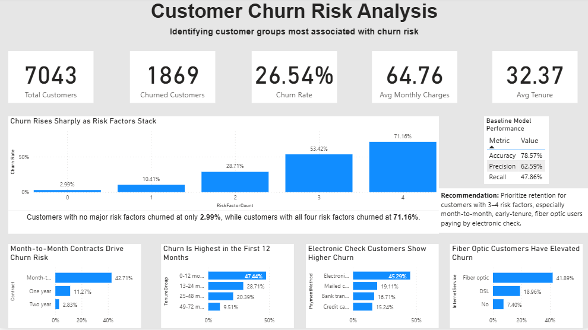

# Customer Churn Risk Analysis

## Project Overview

This project analyzes customer churn behavior using the Telco Customer Churn dataset.

The goal is to identify which customer characteristics are most associated with churn and to build a simple, explainable baseline model for churn prediction.

This project uses Python for data validation, cleaning, exploratory analysis, feature engineering, and logistic regression modeling. Power BI is used to create an executive dashboard that summarizes the most important churn-risk patterns.

---

## Business Objective

The main business question:

**Which customers are most likely to churn, and what factors are linked with higher churn risk?**

This analysis helps customer success and retention teams understand:

- Which customer groups have the highest churn rates
- Which customer characteristics are strongest churn-risk signals
- How churn risk changes as multiple risk factors stack
- Which customers should be prioritized for retention efforts

---

## Dataset Overview

The dataset contains **7,043 customer records** and **21 columns**.

The target column is:

| Target Column | Description |
|---|---|
| `Churn` | Indicates whether a customer churned: `Yes` or `No` |

### Churn Distribution

| Churn Status | Customers | Percentage |
|---|---:|---:|
| No | 5,174 | 73.5% |
| Yes | 1,869 | 26.5% |

The overall churn rate is **26.5%**, meaning roughly 1 in 4 customers in the dataset churned.

---

## Key Columns Used

| Column | Description |
|---|---|
| `customerID` | Unique customer identifier |
| `gender` | Customer gender |
| `SeniorCitizen` | Whether the customer is a senior citizen |
| `Partner` | Whether the customer has a partner |
| `Dependents` | Whether the customer has dependents |
| `tenure` | Number of months the customer has stayed |
| `PhoneService` | Whether the customer has phone service |
| `MultipleLines` | Whether the customer has multiple phone lines |
| `InternetService` | Type of internet service |
| `OnlineSecurity` | Whether the customer has online security |
| `OnlineBackup` | Whether the customer has online backup |
| `DeviceProtection` | Whether the customer has device protection |
| `TechSupport` | Whether the customer has tech support |
| `StreamingTV` | Whether the customer has streaming TV |
| `StreamingMovies` | Whether the customer has streaming movies |
| `Contract` | Customer contract type |
| `PaperlessBilling` | Whether the customer uses paperless billing |
| `PaymentMethod` | Customer payment method |
| `MonthlyCharges` | Monthly customer charges |
| `TotalCharges` | Total customer charges |
| `Churn` | Churn outcome |

---

## Tools Used

- **Python** — data validation, cleaning, EDA, feature engineering, and modeling
- **Pandas** — data manipulation and analysis
- **Scikit-learn** — logistic regression modeling and evaluation
- **Power BI** — dashboard creation and business reporting
- **DAX** — dashboard measures and KPI calculations
- **GitHub** — project documentation and portfolio publishing

---

## Repository Structure

```text
customer-churn-analysis/
│
├── README.md
├── data/
│   └── README.md
├── notebooks/
│   └── churn_analysis.ipynb
├── powerbi/
│   └── customer_churn_risk_dashboard.pbix
└── visuals/
    └── customer_churn_risk_dashboard.png

---

## Project Workflow

### 1. Data Validation and Cleaning

The dataset was first validated to confirm that it was reliable and ready for analysis.

Validation steps included:

- Checking dataset shape
- Reviewing column names
- Checking missing values
- Reviewing churn distribution
- Checking duplicate customer IDs
- Reviewing numeric summaries
- Fixing data type issues

The dataset contained:

| Check | Result |
|---|---:|
| Rows | 7,043 |
| Columns | 21 |
| Duplicate Customer IDs | 0 |
| Churned Customers | 1,869 |
| Non-Churned Customers | 5,174 |
| Churn Rate | 26.5% |

---

## TotalCharges Cleaning

The `TotalCharges` column was originally stored as text.

After converting it to numeric, **11 missing values** appeared. These rows had `tenure = 0`, meaning the customers had not accumulated total charges yet.

Because of this, the missing `TotalCharges` values were filled with `0`.

After cleaning, the dataset had no missing values.

---

## Numeric Summary

| Metric | Mean | Min | 25% | Median | 75% | Max |
|---|---:|---:|---:|---:|---:|---:|
| Tenure | 32.37 | 0 | 9 | 29 | 55 | 72 |
| MonthlyCharges | 64.76 | 18.25 | 35.50 | 70.35 | 89.85 | 118.75 |
| TotalCharges | 2,279.73 | 0 | 398.55 | 1,394.55 | 3,786.60 | 8,684.80 |

The numeric ranges appeared reasonable after cleaning.

---

## Exploratory Churn Analysis

Exploratory analysis was used to identify customer groups with higher churn rates.

The analysis focused on:

- Contract type
- Tenure group
- Monthly charge group
- Internet service
- Payment method

---

### Churn by Contract Type

| Contract Type | Customers | Churned | Churn Rate |
|---|---:|---:|---:|
| Month-to-month | 3,875 | 1,655 | 42.71% |
| One year | 1,473 | 166 | 11.27% |
| Two year | 1,695 | 48 | 2.83% |

Month-to-month customers had the highest churn rate at **42.71%**, compared to only **2.83%** for two-year contract customers.

This makes contract type one of the strongest churn-risk signals.

---

### Churn by Tenure Group

| Tenure Group | Customers | Churned | Churn Rate |
|---|---:|---:|---:|
| 0–12 months | 2,186 | 1,037 | 47.44% |
| 13–24 months | 1,024 | 294 | 28.71% |
| 25–48 months | 1,594 | 325 | 20.39% |
| 49–72 months | 2,239 | 213 | 9.51% |

Churn was highest among customers in their first 12 months.

Customers with 0–12 months of tenure had a churn rate of **47.44%**, while customers with 49–72 months of tenure had a churn rate of only **9.51%**.

This shows that churn risk is heavily concentrated early in the customer lifecycle.

---

### Churn by Monthly Charge Group

| Monthly Charge Group | Customers | Churned | Churn Rate |
|---|---:|---:|---:|
| Low | 1,735 | 189 | 10.89% |
| Medium | 1,725 | 413 | 23.94% |
| High | 1,844 | 697 | 37.80% |
| Very High | 1,739 | 570 | 32.78% |

Customers with higher monthly charges were more likely to churn.

The high-charge group had the highest churn rate at **37.80%**. However, churn did not rise perfectly linearly, as the very-high charge group showed a slightly lower churn rate of **32.78%**.

---

### Churn by Internet Service

| Internet Service | Customers | Churned | Churn Rate |
|---|---:|---:|---:|
| Fiber optic | 3,096 | 1,297 | 41.89% |
| DSL | 2,421 | 459 | 18.96% |
| No internet service | 1,526 | 113 | 7.40% |

Fiber optic customers had the highest churn rate at **41.89%**.

This suggests that fiber optic customers may represent a higher-risk group, possibly due to price sensitivity, service expectations, or customer experience issues.

---

### Churn by Payment Method

| Payment Method | Customers | Churned | Churn Rate |
|---|---:|---:|---:|
| Electronic check | 2,365 | 1,071 | 45.29% |
| Mailed check | 1,612 | 308 | 19.11% |
| Bank transfer automatic | 1,544 | 258 | 16.71% |
| Credit card automatic | 1,522 | 232 | 15.24% |

Customers using electronic check had the highest churn rate at **45.29%**.

This is nearly 3 times higher than customers using credit card automatic payment.

---

## Feature Engineering

Based on the exploratory analysis, several churn-risk features were created.

### Engineered Features

| Feature | Description |
|---|---|
| `ChurnFlag` | Converts churn outcome to binary: Yes = 1, No = 0 |
| `TenureGroup` | Groups customers by tenure range |
| `MonthlyChargeGroup` | Groups customers by monthly charge range |
| `HighRiskContract` | Flags month-to-month customers |
| `EarlyTenureFlag` | Flags customers with tenure of 12 months or less |
| `ElectronicCheckFlag` | Flags customers using electronic check |
| `FiberOpticFlag` | Flags customers using fiber optic internet |
| `RiskFactorCount` | Counts how many major churn-risk factors each customer has |

---

### Feature Flag Counts

| Risk Flag | Customers |
|---|---:|
| HighRiskContract | 3,875 |
| EarlyTenureFlag | 2,186 |
| ElectronicCheckFlag | 2,365 |
| FiberOpticFlag | 3,096 |

These flags represent major customer segments, not tiny edge cases.

---

## Churn by Risk Factor Count

A combined `RiskFactorCount` was created using four major churn-risk indicators:

- Month-to-month contract
- Tenure of 12 months or less
- Electronic check payment method
- Fiber optic internet service

| Risk Factor Count | Customers | Churned | Churn Rate |
|---:|---:|---:|---:|
| 0 | 1,808 | 54 | 2.99% |
| 1 | 1,498 | 156 | 10.41% |
| 2 | 1,818 | 522 | 28.71% |
| 3 | 1,288 | 688 | 53.42% |
| 4 | 631 | 449 | 71.16% |

Churn increased sharply as risk factors stacked.

Customers with no major risk factors churned at only **2.99%**, while customers with all four risk factors churned at **71.16%**.

This creates a simple and powerful churn-risk framework.

---

## Predictive Modeling

A logistic regression model was built to estimate churn risk.

Two model versions were tested:

---

### Model A: Individual Risk Flags

Model A used:

- Tenure
- MonthlyCharges
- TotalCharges
- HighRiskContract
- EarlyTenureFlag
- ElectronicCheckFlag
- FiberOpticFlag

---

### Model B: Combined Risk Score

Model B used:

- Tenure
- MonthlyCharges
- TotalCharges
- RiskFactorCount

Model A performed slightly better and was more explainable, so it was selected as the main baseline model.

---

## Model Performance

| Metric | Model A | Model B |
|---|---:|---:|
| Accuracy | 78.57% | 78.00% |
| Precision | 62.59% | 61.43% |
| Recall | 47.86% | 45.99% |

Model A achieved **78.57% accuracy** and **62.59% precision**, but recall was only **47.86%**.

This means the model correctly identified some churned customers but still missed a large portion of actual churners.

Because recall was modest, the model is best treated as a baseline model for interpretation, not a production-ready churn targeting system.

---

## Model A Confusion Matrix

| Prediction Result | Count |
|---|---:|
| Correctly predicted non-churn | 928 |
| False churn alarms | 107 |
| Missed churners | 195 |
| Correctly predicted churners | 179 |

The model caught **179** churners but missed **195** churners.

For churn prediction, recall would need to be improved before using the model for proactive retention targeting.

---

## Model Coefficients

| Feature | Coefficient | Interpretation |
|---|---:|---|
| HighRiskContract | 1.17 | Month-to-month contract strongly increases churn likelihood |
| FiberOpticFlag | 0.74 | Fiber optic service increases churn likelihood |
| ElectronicCheckFlag | 0.58 | Electronic check payment increases churn likelihood |
| EarlyTenureFlag | 0.46 | Early tenure increases churn likelihood |
| tenure | -0.03 | Longer tenure slightly reduces churn likelihood |
| MonthlyCharges | 0.01 | Higher monthly charges slightly increase churn likelihood |
| TotalCharges | 0.00 | Very small effect after other variables |

The model coefficients aligned with the exploratory analysis.

The strongest churn predictors were:

- Month-to-month contract
- Fiber optic internet service
- Electronic check payment method
- Early tenure

---

## Power BI Dashboard

The Power BI dashboard summarizes the main churn-risk patterns and model performance.



---

## Key Findings

1. Overall churn rate was **26.5%**.
2. Month-to-month customers had the highest churn by contract type at **42.71%**.
3. Customers in their first 12 months had the highest tenure-based churn rate at **47.44%**.
4. Electronic check customers had the highest churn by payment method at **45.29%**.
5. Fiber optic customers had a churn rate of **41.89%**.
6. Customers with zero major risk factors churned at only **2.99%**.
7. Customers with all four major risk factors churned at **71.16%**.
8. Logistic regression provided a useful baseline model, but recall was modest at **47.86%**.

---

## Business Recommendation

Retention efforts should prioritize customers with multiple churn-risk factors, especially customers who are:

- On month-to-month contracts
- In their first 12 months
- Using fiber optic internet
- Paying by electronic check

These customers show substantially higher churn risk and should be targeted with:

- Early onboarding support
- Contract upgrade incentives
- Payment method migration campaigns
- Service quality follow-ups
- Personalized retention offers

---

## Final Insight

Churn risk is not evenly distributed across the customer base.

Customers with no major risk factors churned at only **2.99%**, while customers with all four major risk factors churned at **71.16%**.

This suggests that retention teams should not treat all customers equally. Instead, they should prioritize customers where multiple churn-risk factors stack together.

---

## Limitations

- The logistic regression model is a baseline model and not production-ready.
- Recall was modest, meaning the model missed many actual churners.
- The dataset does not include customer satisfaction scores, complaint history, competitor offers, or service outage information.
- The analysis identifies associations, not direct causation.
- More advanced modeling could improve recall and targeting performance.

---

## Skills Demonstrated

- Python data cleaning and validation
- Exploratory data analysis
- Feature engineering
- Customer segmentation
- Churn-risk analysis
- Logistic regression modeling
- Model evaluation using accuracy, precision, recall, and confusion matrix
- Power BI dashboard design
- Business recommendation writing
- GitHub project documentation
